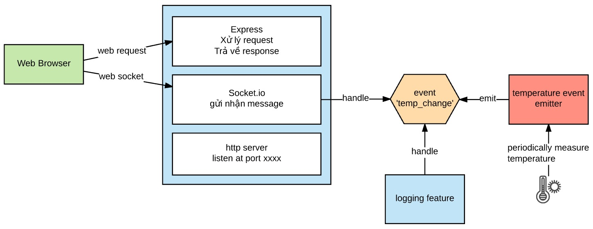

# Ứng dụng demo EventEmitter và Socket.io

Ứng dụng mô phỏng việc lấy dữ liệu từ cảm biến nhiệt độ, xem file
temper_event_emitter.js

Socket.io được dùng cùng với Express. Mỗi khi nhận được event nhiệt độ thay đổi, thì Socket.io lại emit
message temp_change


```javascript
io.on('connection', (socket) => {
  temper_event_emitter.on('temp_change', (data) => {
    let temperature = numeral(data.temp).format('0,0.00');
    console.log(temperature);
    socket.emit('temp_change', {temp: temperature});
  });
});
```

Phía front end, /views/index.html sẽ nhận message temp_change cập nhật vào
```html
<h1 id="temp_display"></h1>
<script>
  var socket = io('http://localhost:8080');
  socket.on('temp_change', (data) => {
    $('#temp_display').text(data.temp);
  });
</script>
```
# Chạy thử
```bash
git clone https://github.com/TechMaster/temperature_socket.git
cd temperature_socket
npm install
npm start
```